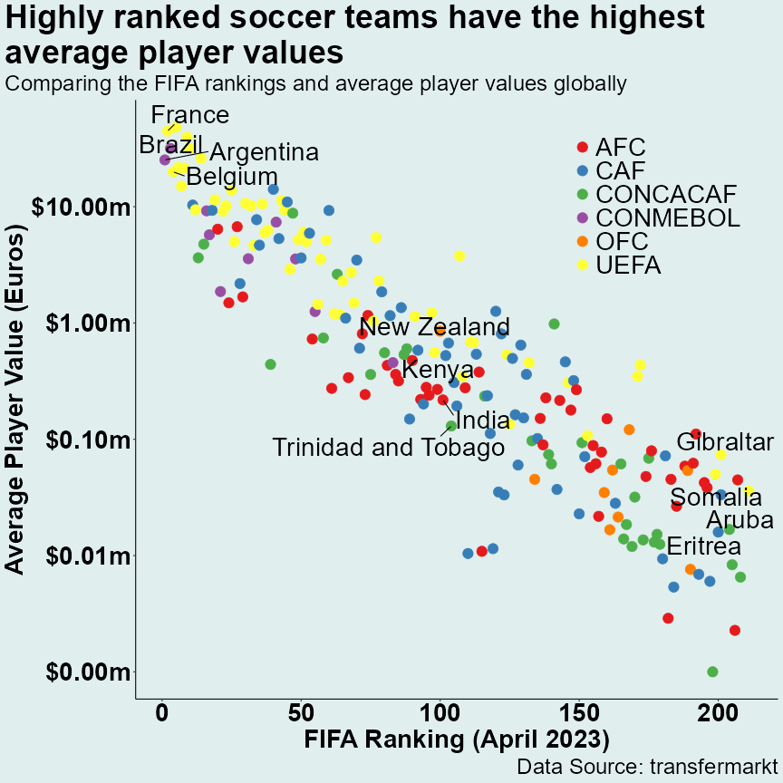

# Sports Data Science

Welcome to the Sports Data Science Repo!

This repository contains code, data, and visualizations related to data science and analytics in the field of sports.

***NOTE: Direct links to the code used to produce the image(s) below will be provided ASAP (if not provided already).***

## Example visualizations

### 1) Market Values in African Football (2023)

### 2) Worldwide FIFA Ranking and Average Market Values

