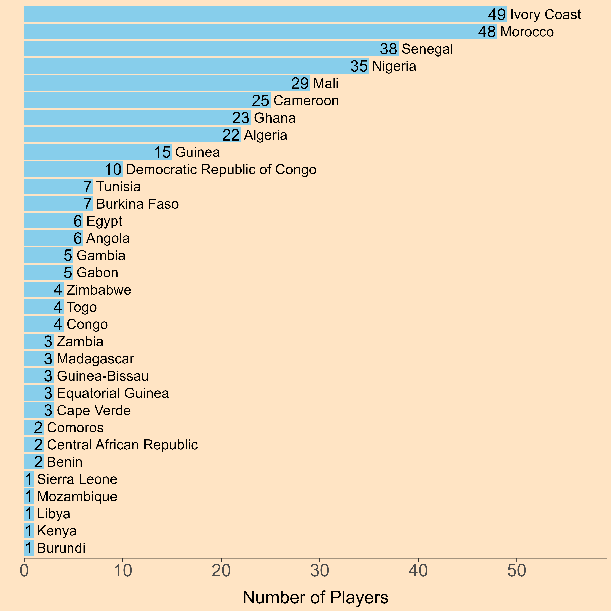
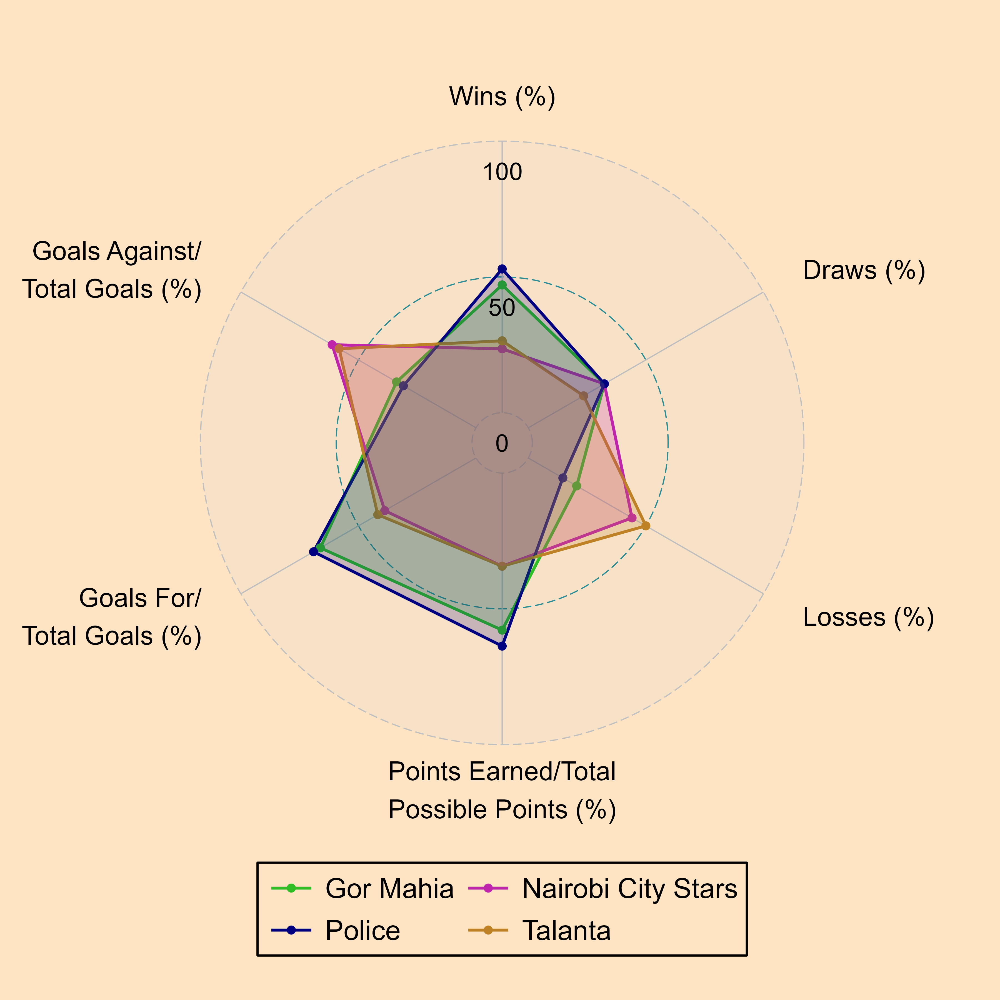

# Sports Data Science

Welcome to the Sports Data Science Repo!

This repository contains code, data, and visualizations related to data science and analytics in the field of sports.

***NOTE: Direct links to the code used to produce the image(s) below will be provided ASAP (if not provided already).***

## Example visualizations

### 1) Market Values in African Football (2023)

[Code](sub_pro_12_fifa_tm_analysis/r_scripts/fifa_transfermarkt_top_player.R)

### 2) Worldwide FIFA Ranking and Average Market Values

[Code](sub_pro_12_fifa_tm_analysis/r_scripts/fifa_transfermarkt.R)

### 3) Number of African Players in Top 5 Euro Leagues

[Code](sub_pro_9_fb_ref_big_5_euro_league/r_scripts/fb_ref_big_5_euro_league_africa_1.R)

### 4) Comparison of Top 2 and Bottom 2 Teams in the Kenya Premier League

[Code](sub_pro_1_kpl_analysis/r_scripts/kpl_analysis_24_25.R)

